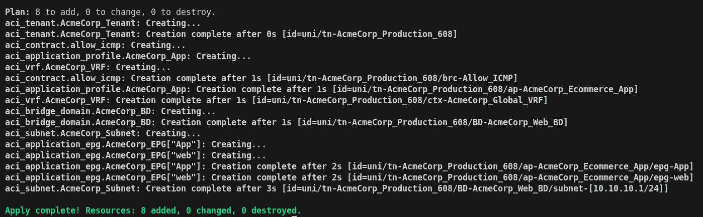
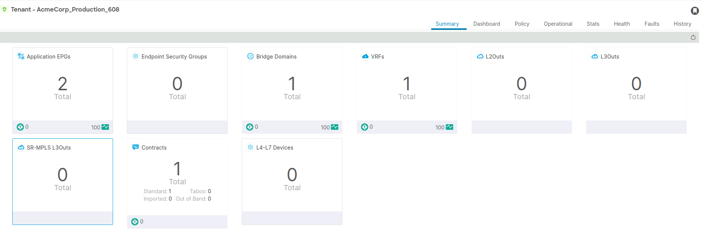
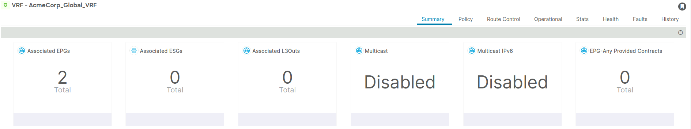
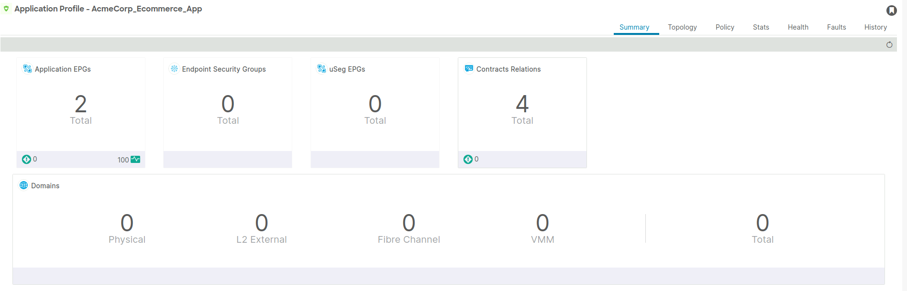
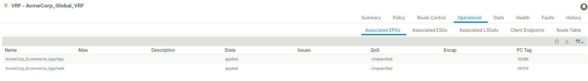

# Terraform ACI Network Blueprint

This project demonstrates how to build a Cisco ACI logical network model using Terraform and the Cisco ACI provider.

The configuration creates a reusable ACI blueprint including a Tenant, VRF, Bridge Domain, Subnet, Application Profile, EPGs, and Contract-based communication.

---

## Project Purpose

The goal of this lab is to show how Cisco ACI infrastructure can be managed using Infrastructure as Code.

Instead of manually creating ACI objects from the APIC GUI, this project uses Terraform to define and deploy the logical network model in a repeatable and structured way.

---

## Logical Design

This design represents a basic Cisco ACI application network blueprint:

- A dedicated Tenant is created for logical separation.
- A VRF provides Layer 3 routing context.
- A Bridge Domain defines Layer 2 forwarding and subnet association.
- Multiple EPGs are created dynamically using Terraform variables.
- A contract is attached to the EPGs to allow controlled communication.

---

## Terraform Execution

This shows the actual deployment of the infrastructure using Terraform.

  

The output confirms that all ACI resources were successfully created, including the tenant, VRF, bridge domain, subnet, application profile, EPGs, and contract.

---

## Cisco ACI Deployment

The following screenshots show the deployed resources in Cisco APIC after applying Terraform.

### Tenant and VRF

  

  

### Application Profile and EPGs

  

  

These screenshots validate that the configuration has been successfully applied and is visible in the APIC GUI.

---

## Validation

This project was validated using multiple steps to ensure consistency between the Infrastructure as Code and the deployed environment:

- Terraform plan output to verify intended changes before deployment
- Terraform apply results to confirm successful resource creation
- Cisco APIC GUI verification to ensure all objects (Tenant, VRF, Bridge Domain, EPGs, and Contracts) are correctly instantiated
- Cross-check between Terraform state and ACI fabric configuration

This ensures that the defined configuration accurately reflects the deployed network state.

---

## Verification

- EPGs are correctly associated with the Bridge Domain  
- Contracts are applied and visible under both provided and consumed relationships  
- Subnet is correctly attached to the Bridge Domain  
- Resources created in Terraform match those visible in Cisco APIC

---

## Tools and Technologies

- Terraform
- Cisco ACI
- Cisco APIC
- CiscoDevNet ACI Terraform Provider
- Infrastructure as Code
- GitHub

---

## Key Terraform Concepts Used

This project demonstrates:

- Provider configuration
- Variables
- Sensitive variables
- Resource dependencies
- Dynamic resource creation using for_each
- Reusable configuration structure
- Infrastructure as Code for network automation

---

## Notes

- All credentials and IPs shown are from a lab environment
- No production systems are exposed
- Sensitive files are excluded using .gitignore
